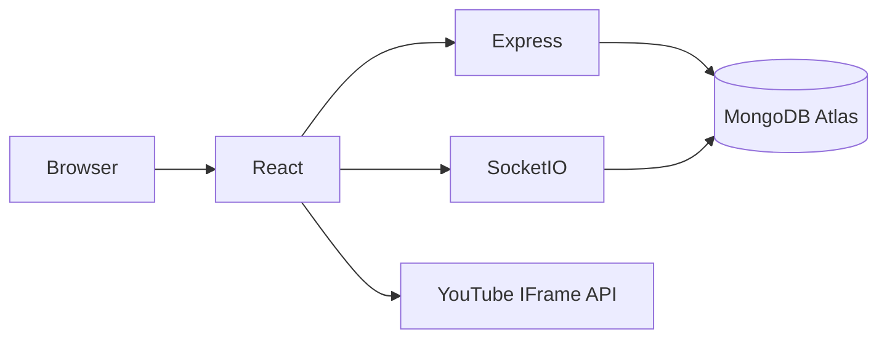
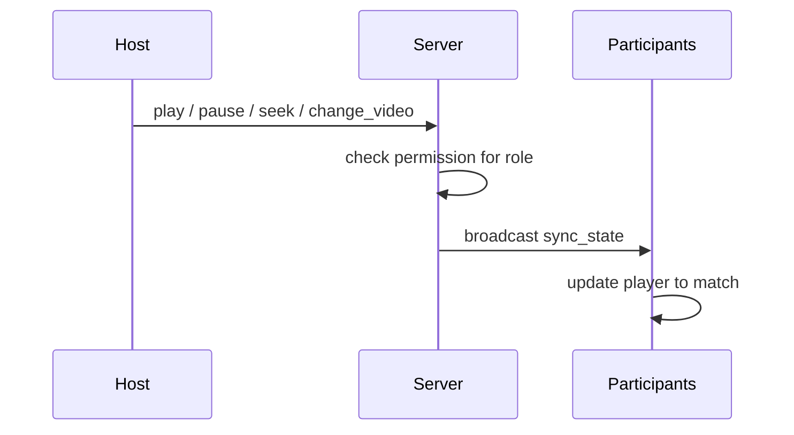

# 🎬 WatchParty

> **Real-Time YouTube Watch Party Platform**

WatchParty is a full-stack real-time web application that lets multiple users watch YouTube videos together in perfectly synchronized playback. A host (or moderator) controls play, pause, seek, and video changes, while every connected participant stays in sync automatically via Socket.IO — with all permissions enforced server-side.

**Live Demo:** Frontend → [youtube-watch-party-sigma.vercel.app](https://youtube-watch-party-sigma.vercel.app) · Backend → [youtube-watch-party-rztg.onrender.com](https://youtube-watch-party-rztg.onrender.com)

**Repository:** [github.com/Krishn-01/youtube-watch-party](https://github.com/Krishn-01/youtube-watch-party)

**Demo Video:** _Add your YouTube (Unlisted) or Google Drive demo video link here._

---

## 🚀 Overview

- **Create / Join Room** — 8-character room codes, display names, session persistence
- **Synchronized Playback** — play, pause, seek, and video changes stay in sync in real time
- **YouTube IFrame API** — embedded player with late-join state recovery (new joiners catch up instantly)
- **Role-Based Access** — Host, Moderator, and Participant, with permissions enforced on the server, not just hidden in the UI
- **Participant Management** — live participant list, role assignment, host transfer, remove participant
- **Production Ready** — Docker, Render, and Vercel configs included

## 🏗️ System Architecture



REST handles room creation and joining. Socket.IO handles playback sync, roles, and participant updates. Playback state lives in MongoDB, and elapsed time is computed on the fly for anyone who joins late.

## 🔄 Sync Sequence



## 📦 Tech Stack

| Layer | Stack |
|-------|-------|
| Frontend | React 18, Vite, Tailwind CSS, React Router, Socket.IO Client |
| Backend | Node.js, Express, Socket.IO |
| Database | MongoDB (Atlas) |
| Deployment | Vercel (frontend), Render (backend) |

## 📁 Folder Structure

```text
Youtube_Watch_Application/
├── client/
│   └── src/
│       ├── components/
│       │   ├── layout/       # App shell
│       │   ├── room/         # Room UI, player, participants
│       │   └── ui/           # Shared UI primitives
│       ├── constants/        # Role definitions and permission helpers
│       ├── context/          # Socket.IO provider
│       ├── hooks/            # YouTube player hook
│       ├── pages/            # Route pages
│       ├── services/         # REST API client
│       └── utils/            # Helpers
├── server/
│   └── src/
│       ├── config/           # Database connection
│       ├── constants/        # Server-side roles
│       ├── controllers/      # REST handlers
│       ├── middleware/       # Error handling
│       ├── models/           # Mongoose schemas
│       ├── routes/           # Express routes
│       ├── socket/handlers/  # Socket event handlers
│       └── validators/       # Request validation
├── docker-compose.yml        # Local MongoDB
├── Dockerfile                # Full-stack production image
├── render.yaml                # Render deployment
└── client/vercel.json          # Vercel SPA routing
```

## 🔐 Role Permissions

| Action | Host | Moderator | Participant |
|--------|:----:|:---------:|:-----------:|
| Play / Pause / Seek | ✅ | ✅ | ❌ |
| Change Video | ✅ | ✅ | ❌ |
| Assign Role | ✅ | ❌ | ❌ |
| Remove Participant | ✅ | ❌ | ❌ |
| Transfer Host | ✅ | ❌ | ❌ |
| View Participants | ✅ | ✅ | ✅ |

Participants can't perform restricted actions even by emitting socket events directly — the server rejects unauthorized requests regardless of what the client sends.

## ⚙️ Setup

### Clone & Install

```bash
git clone <repo-url>
cd Youtube_Watch_Application
npm run install:all
cp server/.env.example server/.env
cp client/.env.example client/.env
```

### Environment Variables

**Server** (`server/.env`):

```env
PORT=5000
MONGODB_URI=mongodb://localhost:27017/youtube-watch-party
CLIENT_URL=http://localhost:5173
NODE_ENV=development
```

**Client** (`client/.env`):

```env
VITE_API_URL=http://localhost:5000
VITE_SOCKET_URL=http://localhost:5000
```

For production, set `CLIENT_URL` to your deployed frontend URL(s) — comma-separate multiple origins if needed.

### Run Locally

Start MongoDB (Docker):

```bash
docker-compose up -d
```

Run client and server together:

```bash
npm run dev
```

- Frontend → http://localhost:5173
- Backend → http://localhost:5000/api/health

The Vite dev server proxies `/api` and `/socket.io` to the backend.

### Backend only

```bash
cd server
npm install
npm run dev
```

### Frontend only

```bash
cd client
npm install
npm run dev
```

## 🌐 API Endpoints

| Method | Endpoint | Description |
|--------|----------|-------------|
| GET | `/api/health` | Health check |
| POST | `/api/rooms` | Create a room |
| GET | `/api/rooms/:roomId` | Get room info |
| POST | `/api/rooms/:roomId/join` | Join a room |

## 📡 Socket Events

**Client → Server**

| Event | Payload | Permission |
|-------|---------|------------|
| `join_room` | `{ roomId, odId }` | Registered participant |
| `leave_room` | — | Any connected user |
| `play` | `{ currentTime }` | Host, Moderator |
| `pause` | `{ currentTime }` | Host, Moderator |
| `seek` | `{ currentTime }` | Host, Moderator |
| `change_video` | `{ videoId }` | Host, Moderator |
| `assign_role` | `{ targetOdId, role }` | Host |
| `remove_participant` | `{ targetOdId }` | Host |
| `transfer_host` | `{ targetOdId }` | Host |

All client events support an acknowledgement callback: `(response) => void`.

**Server → Client**

| Event | Description |
|-------|-------------|
| `sync_state` | Playback sync (play, pause, seek, change_video, initial state) |
| `user_joined` | A participant connected to the room |
| `user_left` | A participant disconnected or left |
| `role_assigned` | A participant's role changed |
| `participant_removed` | A participant was removed by the host |

## 🏭 Production Build

```bash
npm run build
npm run start:prod
```

Express serves the built React app from `client/dist` when `NODE_ENV=production`.

## ☁️ Deployment

### Render (full stack / backend)

1. Push to GitHub
2. Create a Web Service on [Render](https://render.com)
3. Use `render.yaml` or set:
   - **Build:** `npm run install:all && npm run build`
   - **Start:** `npm run start:prod`
4. Set `MONGODB_URI` and `CLIENT_URL`

### Docker

```bash
docker build -t youtube-watch-party .
docker run -p 5000:5000 \
  -e MONGODB_URI=your_uri \
  -e CLIENT_URL=https://your-domain.com \
  youtube-watch-party
```

### Vercel (frontend)

Deploy the `client/` directory with:

```env
VITE_API_URL=https://your-backend.onrender.com
VITE_SOCKET_URL=https://your-backend.onrender.com
```

Point `CLIENT_URL` on the backend to your Vercel URL.

## 🎥 Live Demo

| | |
|---|---|
| Frontend | [youtube-watch-party-sigma.vercel.app](https://youtube-watch-party-sigma.vercel.app) |
| Backend API | [youtube-watch-party-rztg.onrender.com](https://youtube-watch-party-rztg.onrender.com) |
| GitHub Repo | [github.com/Krishn-01/youtube-watch-party](https://github.com/Krishn-01/youtube-watch-party) |
| Demo Video | _Add your YouTube (Unlisted) or Google Drive demo video link here_ |

## 🔭 Future Enhancements

- Authentication
- In-room chat
- Emoji reactions
- Redis adapter for horizontal scaling across multiple server instances

## 🎓 Learning Outcomes

Building WatchParty involved hands-on work with WebSockets and Socket.IO, REST API design, MongoDB integration, real-time state synchronization, and debugging distributed client state — plus taking a project from local dev through to a live production deployment.

## 👨‍💻 Author

**Krishn Kumar Pandey**

## 📄 License

MIT

---

⭐ If you found this project useful, please consider starring the repository.
